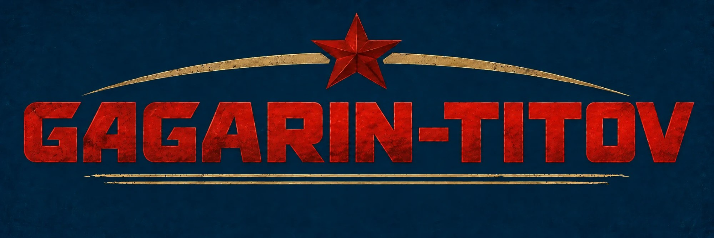
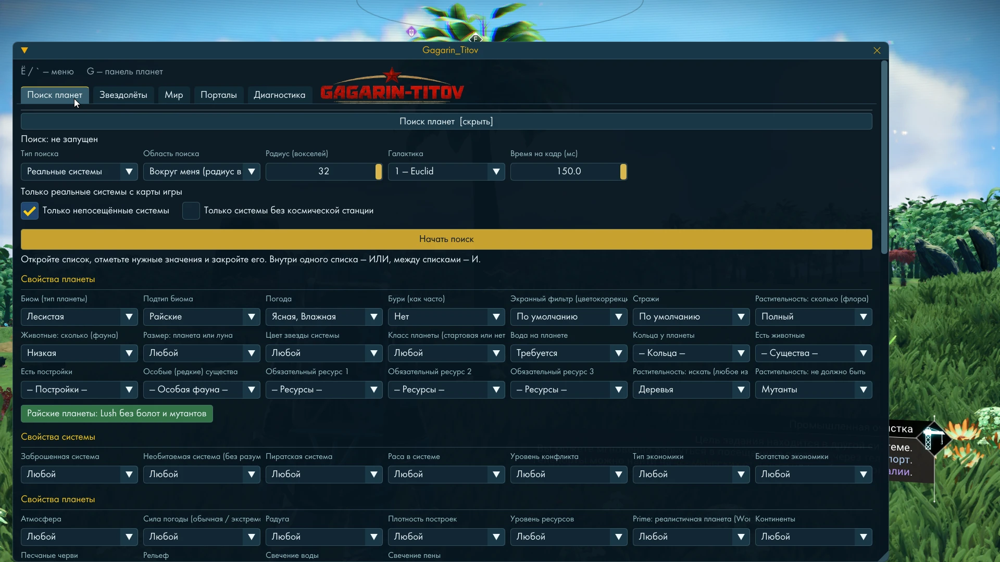
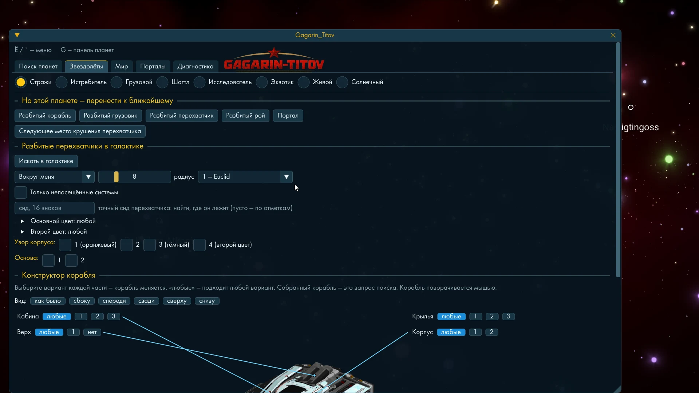
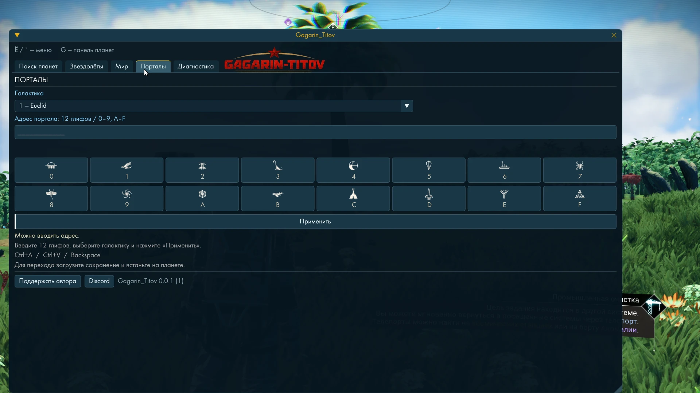

# Gagarin_Titov

**Мод для No Man's Sky** — меню прямо в игре: поиск планет и кораблей по всей галактике, телепорт по адресу,
постройка любых деталей где угодно, настройки разработчиков игры. Интерфейс на всех 17 языках игры. Бесплатно.

**Версия мода:** 0.0.1 · **Версия игры:** No Man's Sky 4228 (Steam, Windows)

## Скачать и установить

**Что скачивать:** один файл — **`Gagarin_Titov_0.0.1.zip`** (11 МБ) в разделе [**Releases**](../../releases/latest),
внизу страницы выпуска, в списке «Assets». Файлы «Source code» там — НЕ мод, их GitHub добавляет сам.

**Что внутри архива:**

```
Gagarin_Titov_0.0.1.zip
├── Binaries\winmm.dll          ← сам мод (один файл)
├── GAMEDATA\Gagarin\           ← каталог кораблей и значки деталей для меню
└── Gagarin_Titov\              ← это описание и лицензия шрифта (для игры не нужно)
```

**Установка — 5 шагов:**

1. **Закрой игру.**
2. **Открой папку игры:** Steam → «Библиотека» → правой кнопкой по **No Man's Sky** → «Управление» →
   «Просмотреть локальные файлы». Откроется папка, обычно
   `C:\Program Files (x86)\Steam\steamapps\common\No Man's Sky\` — в ней лежат папки `Binaries` и `GAMEDATA`.
3. **Открой архив** `Gagarin_Titov_0.0.1.zip` (двойной щелчок), выдели всё внутри (`Binaries`, `GAMEDATA`,
   `Gagarin_Titov`) и **перетащи прямо в папку `No Man's Sky`** — в ту самую, которую открыл в шаге 2, где видны
   папки `Binaries` и `GAMEDATA`.
   - **Не внутрь** `Binaries` и **не внутрь** `GAMEDATA` — именно в `No Man's Sky`, на один уровень с ними.
   - Папки из архива сольются с папками игры с теми же именами. Windows спросит «Объединить папки?» или
     «Заменить файлы?» — отвечай **«Да» / «Заменить»**. Файлы игры при этом не меняются: добавляются только файлы мода.

   Должно получиться так:

   ```
   No Man's Sky\                       ← сюда перетаскивать
   ├── Binaries\
   │   ├── NMS.exe                     (игра, была)
   │   └── winmm.dll                   ← мод, добавился
   ├── GAMEDATA\
   │   ├── PCBANKS\                    (игра, была)
   │   └── Gagarin\                    ← данные мода, добавилась
   │       ├── ships\catalog.txt, icons.bin
   │       └── parts\icons.bin
   └── Gagarin_Titov\                  ← описание, можно удалить
   ```
4. **Проверь:** файл **`winmm.dll`** лежит в `No Man's Sky\Binaries\` рядом с `NMS.exe`.
5. **Запусти игру**, загрузи сохранение и нажми **`Ё`** (на английской раскладке `~`) — откроется меню
   **Gagarin_Titov**. Клавиша **`G`** — таблица планет.

**Удалить мод:** удали файл `No Man's Sky\Binaries\winmm.dll`. Папку `GAMEDATA\Gagarin` можно удалить тоже —
там настройки и журнал мода. Игра и сохранения не меняются.

---

## Как это выглядит

Всё снято прямо в игре.

**Поиск планет** — свойства планеты и системы, «Райские планеты» одной кнопкой:



**Звездолёты** — перенос к разбитым кораблям на планете, перехватчики в галактике, конструктор корабля:



**Порталы** — 12 глифов, галактика, «Применить»:



---

## Что умеет

Меню открывается клавишей **`Ё`** (`~`), таблица планет текущей системы — клавишей **`G`**.

### Поиск планет

- Перебирает системы галактики **генератором самой игры** — без полётов и загрузки миров.
- Фильтры: биом и его подтип, погода и бури, стражи, вода и её прозрачность, флора и фауна, ресурсы, «райские»
  планеты, размер, кольца, тип звезды, экономика, раса и уровень конфликта системы, условия для существ,
  растительность (деревья, грибы, кактусы, кораллы и т. д.).
- Цвета воды, травы, растений, листьев и неба — по группам (синие, зелёные, светлые, тёмные…) или по точному образцу.
- Область: текущая система, вокруг тебя или вся галактика. Найденное сохраняется, к любой планете — телепорт
  одной кнопкой.
- Сводка «почему планеты не подошли» — какое условие отсеяло больше всего.

### Звездолёты

- Поиск кораблей по деталям и цветам: истребители, грузовые, шаттлы, исследователи, экзотики, живые, солнечные,
  перехватчики стражей, грузовики.
- **Сборщик корабля по частям:** выбираешь вариант каждой части — корабль на экране меняется; собранный корабль
  и есть запрос поиска. Поворот мышью, готовые ракурсы.
- **Подбор сида по виду** — на всех ядрах процессора; показывает, насколько редок выбранный вид.
- **Разбитые перехватчики стражей в галактике:** где лежит нужный, телепорт к месту крушения.
- **«На этой планете»:** перенос к ближайшему разбитому кораблю, грузовику, перехватчику, рою или порталу.

### Мир

- **Время суток:** «Авто день» и «Авто ночь».
- **Настройки разработчиков игры** — флаги самой игры, включаются галочками:
  - бессмертие; без урона; бесконечная выносливость;
  - всё бесплатно (строительство, покупки); базе не нужно электричество;
  - прыжок по карте галактики без топлива и без нужного двигателя;
  - повторяемые простые взаимодействия; кнопки без удержания;
  - перенос базы в терминале базы; сохранение на заброшенных грузовиках; миссии без нужного ранга;
  - открытая карта системы; без облаков; остановка смены дня и ночи; скрыть интерфейс игры для снимков.
- **Поставить любую деталь:** детали, которых нет в наземном меню строительства, — станции, грузовика, корвета
  и скрытые. Каталог с картинками и поиском по названию. Можно показать скрытые детали прямо в меню строительства игры.
- **Масштаб детали:** ставь деталь любого размера.
- **Удаление в обход запретов:** когда рядом корабль («Слишком близко к кораблю») и переходник шлюза.
- **Все детали везде:** база, корвет, грузовик, станция.
- **Повышенные пределы строительства.**
- **Варп из меню открытий:** на странице «Открытия» планеты появляется строка «Телепорт» — клавиша `X`
  (меняется) или `Y` на геймпаде.
- **Галактический сканер** — открывает все планеты текущей системы; **«Сканировать планету»** — все растения,
  минералы и животных под ногами, с наградой, как после визора.
- **Язык меню** — любой из 17 языков игры, действует сразу.

### Порталы

- 12 глифов, выбор галактики (с номером и названием), «Применить» — и ты на месте.

### Таблица планет (`G`)

- Полоса сверху экрана со всеми планетами системы: имя, биом, погода, стражи, вода, ресурсы, образцы цветов,
  небо днём, в сумерках и ночью.

---

## Важно

### Скорость и подтормаживания

Мод работает внутри игры и делит с ней процессор. Сколько он занимает от каждого кадра — доли секунды или больше —
**зависит от мощности компьютера**. Тяжелее всего поиск планет, подбор сида корабля (он занимает все ядра процессора)
и сканеры. Пока они идут, игра **может подтормаживать**: падает число кадров, бывают рывки. Закончил поиск или нажал
«Стоп» — всё возвращается. На слабом компьютере ставь поиск меньшей области (текущая система или «вокруг меня»),
а не всю галактику.

У поиска планет есть ползунок **«Время на кадр (мс)»** — сколько миллисекунд от каждого кадра игры отдаётся поиску
(от 0,25 до 150; по умолчанию 2). Больше — поиск быстрее, но игра тормозит сильнее; меньше — игра плавнее, поиск
дольше. Подбирай под свой компьютер: если картинка дёргается — уменьшай.

### Сохранения

«Поставить любую деталь», «Все детали везде» и «Удаление в обход запретов» меняют то, что игра записывает в
сохранение. **Перед первыми опытами сделай копию папки сохранений:**

```
%APPDATA%\HelloGames\NMS
```

Это твои часы игры — лишняя копия никому не мешала.

### Сетевая игра

По умолчанию функции работают и в сетевой игре. Галочка **«Только при выключенном Multiplayer»** на вкладке «Мир»
отключает всё, что меняет игру, пока Multiplayer включён. Не порти игру другим.

### Обновление игры

Мод привязан к версии игры. После обновления No Man's Sky он сверяет `NMS.exe` и, если версия не та, **не
включается** — игра при этом работает как обычно. Новая версия мода под новую игру выходит здесь же.

### Автообновление

При запуске игры мод сверяет свою версию с этим репозиторием и сам скачивает новую `winmm.dll` (проверяя размер и
контрольную сумму). Новая версия вступает при следующем запуске игры. Отключается галочкой на вкладке «Мир».

### Антивирус ругается

Мод — это DLL, которую игра загружает сама. Некоторые антивирусы настороженно относятся к таким файлам у любых модов.
Хочешь убедиться, что скачал именно то, что выложено, — сверь контрольную сумму.

---

## Проверить, что файл не подменили

Контрольные суммы всех файлов — в `SHA256SUMS.txt`. Сверить у себя (PowerShell):

```powershell
Get-FileHash "C:\Program Files (x86)\Steam\steamapps\common\No Man's Sky\Binaries\winmm.dll" -Algorithm SHA256
```

Строка должна совпасть со строкой `winmm.dll` в `SHA256SUMS.txt`.

---

## Как устроено

Игра при запуске загружает `winmm.dll`. Gagarin_Titov передаёт все 181 функцию системной `winmm.dll` из
`Windows\System32` без изменений — звук и таймеры игры работают как обычно — и запускает меню отдельным потоком.

- Настройки: `No Man's Sky\GAMEDATA\Gagarin\settings.txt`
- Журнал: `No Man's Sky\GAMEDATA\Gagarin\logs\`

---

## Если что-то не так

Напиши мне: что делал, что ожидал, что получилось. Пригодятся версия игры, язык меню и журнал
`GAMEDATA\Gagarin\logs\` (последняя папка).

- Discord: [autoeme](https://discord.com/users/683764720821600301)
- Nexus Mods: [GAGARIN NMS](https://www.nexusmods.com/nomanssky/mods/4359)
- GitHub: [autoeme](https://github.com/autoeme)

Кнопки «Поддержать автора» и Discord есть и в самом меню, внизу.

**Поддержать:** [DonationAlerts](https://www.donationalerts.com/r/autoeme)

---

Мод бесплатный и делается одним человеком. No Man's Sky, её детали, названия и шрифт принадлежат Hello Games —
мод показывает и использует то, что уже лежит в твоей копии игры. Шрифт меню — NMS Futura Pro Book из игры, условия —
`NMS-Font-LICENSE.txt`, источник — `NMS-Font-source.json`.
